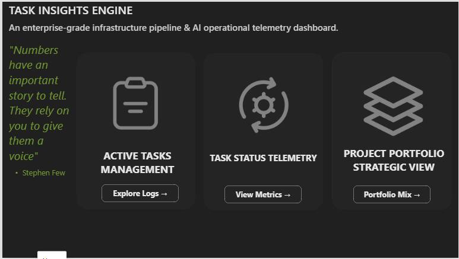
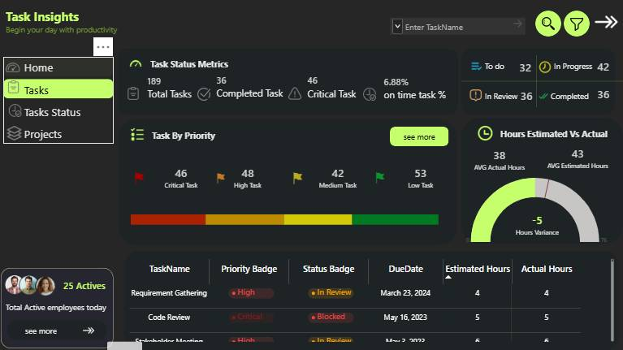
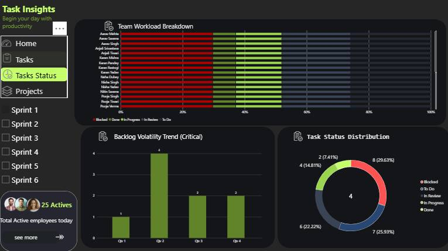
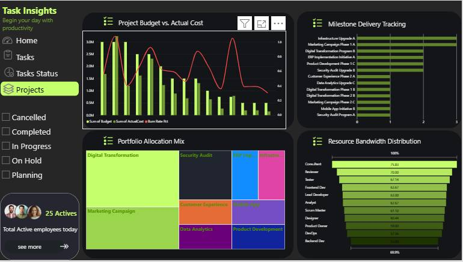

# Task Insights Engine

An **enterprise-grade infrastructure pipeline & AI operational telemetry dashboard** designed to streamline operations, monitor work velocity, and manage project portfolio health in real time. 

---

## 📌 Project Overview

The **Task Insights Engine** bridges the gap between raw project telemetry and strategic execution. By aggregating live system logs, task queues, and budget metrics, it gives teams a single pane of glass to track operational status, monitor workload distribution, and measure overall project velocity.

> *"Numbers have an important story to tell. They rely on you to give them a voice."*  
> — **Stephen Few**

---

## 🖼️ Dashboard Architecture & Navigation

The platform is split into four distinct structural layers to serve roles from individual engineers to executives.

### 1. Landing Portal & Main Gateway
The entry point directs users straight to their specific operational viewports.

*   **Active Tasks Management:** Immediate access to operational infrastructure pipelines.
*   **Task Status Telemetry:** Direct deep dive into team metrics and sprint workloads.
*   **Project Portfolio Strategic View:** High-level oversight of budgets, milestones, and asset mixes.

---

### 2. Operational Tasks Workspace
Designed for daily operational monitoring, this view surfaces active task tallies, priorities, and historical time tracking variance.

*   **Task Status Metrics:** Highlights total tasks (**189**), completed tasks (**36**), critical blocks (**46**), and overall **on-time completion percentage (6.88%)**.
*   **Kanban Swimlane Buckets:** Fast breakdown of status queues:
    *   *To Do:* 32
    *   *In Progress:* 42
    *   *In Review:* 36
    *   *Completed:* 36
*   **Task By Priority Matrix:** Tracks remaining tasks against strict severity buckets (*Critical: 46*, *High: 48*, *Medium: 42*, *Low: 53*).
*   **Hours Variance Indicator:** An interactive gauge displaying actual vs. estimated hours (**-5 hours variance** across a **38-hour actual** vs. **43-hour estimated** baseline).
*   **Live Data Grid:** A complete tabular list containing task names, dynamic color-coded priority/status badges, due dates, and precise time splits.

---

### 3. Analytics & Workload Telemetry
Focuses on sprint management, team capacity constraints, and historical backlog volatility.

*   **Team Workload Breakdown:** A 100% stacked horizontal bar chart charting individualized allocations across blocked, done, in-progress, in-review, and to-do queues.
*   **Backlog Volatility Trend (Critical):** A quarterly bar chart tracking the creation and age of high-priority blockers.
*   **Task Status Distribution:** A segmented radial donut chart mapping percentage distribution across the active development landscape.
*   **Sprint Scope Selectors:** Left-side dynamic filters to quickly slice information across **Sprint 1 through Sprint 6**.

---

### 4. Project Portfolio & Financial Health
Tailored for program managers to analyze investment distributions, burn rates, and overall resource allocation.

*   **Project Budget vs. Actual Cost:** Dual-axis chart overlaying actual spends (bar) against systemic burn rate percentages (line) scaling up past **\$3.0M**.
*   **Milestone Delivery Tracking:** Gantt-style horizontal progress bars tracking high-priority initiatives like *Infrastructure Upgrade A*, *Digital Transformation Program*, and *Security Audit Upgrade*.
*   **Portfolio Allocation Mix:** A clean treemap visualization packing project domains by size (*Digital Transformation*, *Marketing Campaign*, *Data Analytics*, etc.).
*   **Resource Bandwidth Distribution:** A horizontal funnel depicting operational utilization percentages across varying roles (Consultants, Testers, Frontend Developers, Scrum Masters, and Designers).

---

## 🛠️ Interface Design Tokens

To ensure consistency across custom UI implementations or modifications, the application uses the following dark-mode UI design tokens:

| Token Element | Value / Description |
| :--- | :--- |
| **Primary Theme** | Dark Mode (`#121212` background base) |
| **Accent Glow** | Electric Lime / Neon Green (`#A3E635` / `#BCF344`) |
| **Critical Alerts** | Deep Crimson (`#EF4444`) |
| **Warnings / Blocked** | Golden Amber (`#F59E0B`) |
| **In Progress** | Sky Blue (`#0EA5E9`) |

---

## 🚀 Future Roadmap

*   **Predictive Slippage Alerts:** AI engine integration to flag milestone delays before they impact the critical path.
*   **Automated Slack/Teams Sync:** Direct alerting mechanisms for critical tasks entering a `Blocked` status badge state.
*   **Cross-Tenant Data Exports:** Export clean, executive-ready summaries in PDF or Excel formats straight from the portfolio view.
